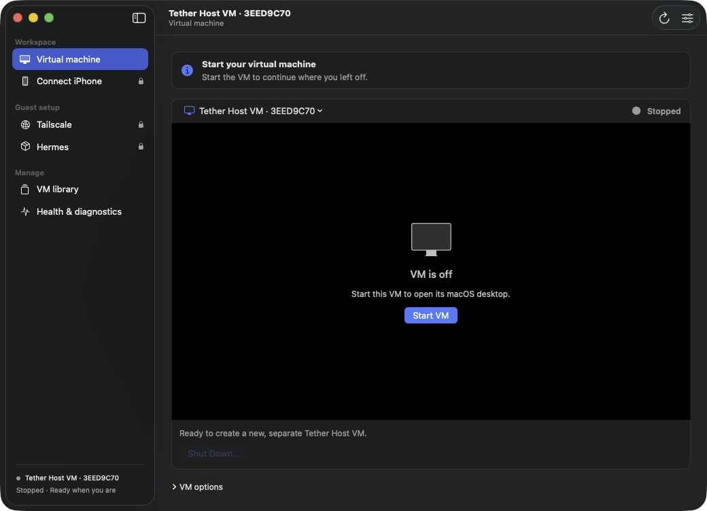

# Tether Host for Mac

Run a macOS virtual machine for your Hermes agent and connect to it from [Tether Flow on iPhone](https://github.com/sladebot/Tether). Tether Host manages the VM, guides guest setup, and verifies the connection.

**[Download build 92](https://github.com/sladebot/Tether-Host/releases/tag/v1.0.0-build.92-preview)** · Requires Apple silicon and macOS 14 or newer.



## Install

1. Download the DMG and matching `.sha256` file from the release above.
2. Verify the download:

   ```sh
   shasum -a 256 -c Tether-Host-for-Mac-v1.0.0-build-92-preview.dmg.sha256
   ```

3. Quit any running Tether Host, open the DMG, and drag **Tether Host for Mac** to Applications.

Updating the app preserves existing VM disks and configuration. Keep only one host copy running.

## Set up and connect

1. **Create a VM.** Choose **Create virtual machine** or **VM library → Create New VM**. Download macOS or choose a compatible IPSW, then select CPU, memory, disk capacity, and storage location. Complete macOS setup and choose **Desktop is ready**.
2. **Set up the guest.** Inside the VM, open **Tether Guest Installer** on the **Tether Guest Setup** disk. Follow its steps for Tailscale, Hermes, model sign-in, computer-use permissions, and connection verification.
3. **Connect your iPhone.** Join the same Tailscale network. In Tether Host, open **Connect iPhone** and copy the server URL and API token. In Tether Flow, add a **Hermes API Server**, tap **Test Connection**, and save it.

Keep the VM running while using Tether. If its files are on an external drive, keep that drive connected. Use at least 64 GB of virtual disk capacity; smaller disks are experimental.

## Preview limitations

- **Not notarized:** build 92 is ad-hoc signed, not a production release.
- **No network containment:** Apple NAT provides internet access but does not block reachable host or local-network services. Disable **Enable internet access on next start** for an offline VM.
- **Acceptance testing is incomplete:** a clean-VM, physical-iPhone end-to-end run is still outstanding.
- **macOS guests only:** this release uses Apple Virtualization. UTM integration is removed; Debian restoration is separate.

The app does not share host folders or automatically synchronize clipboards. Connection tokens are stored in Keychain; explicitly copied tokens clear after 45 seconds if unchanged.

## Development

Open `TetherHost.xcodeproj` in Xcode with Swift 6, select **Tether Host for Mac**, and build for **My Mac**.

Run automated checks:

```sh
python3 -m venv build/test-venv
build/test-venv/bin/python -m pip install -r requirements-test.txt
TETHER_TEST_PYTHON="$PWD/build/test-venv/bin/python" bash scripts/verify.sh
```

Build a preview DMG and checksum with `./scripts/build-preview.sh`.

## Details

- [Architecture and security boundaries](docs/tether-host-architecture.md)
- [Guest setup](docs/guest-setup-implementation.md)
- [Verification and acceptance status](docs/tether-host-verification.md)
- [Signing and notarization](docs/tether-host-distribution.md)
