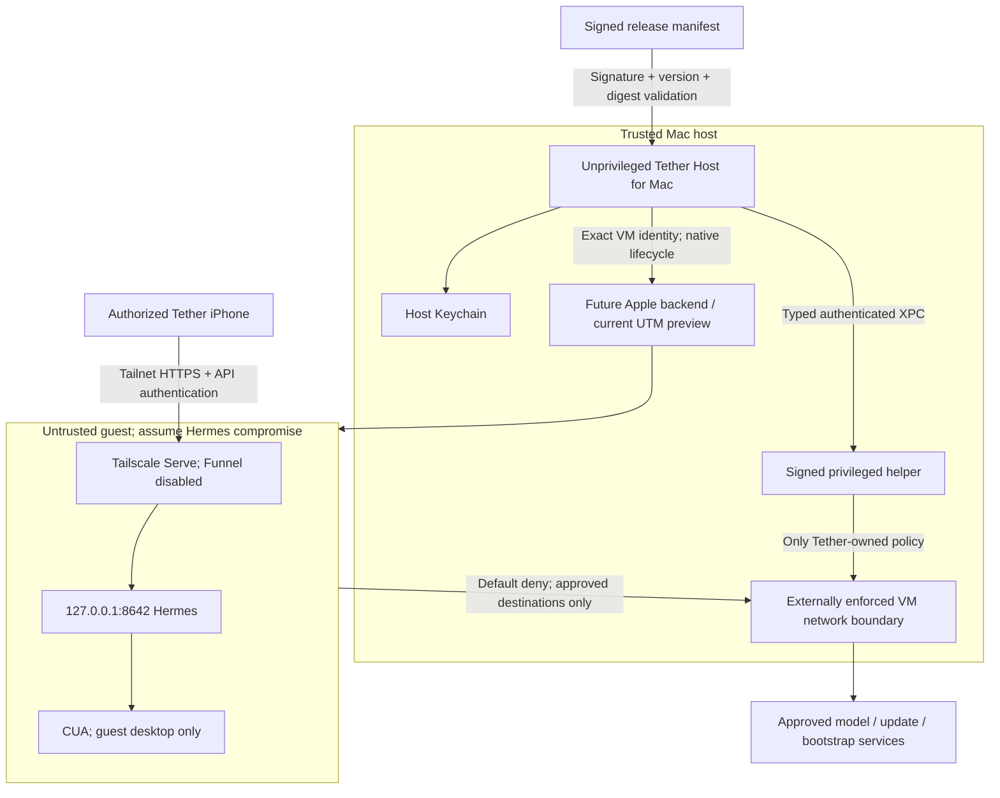

# Tether Host for Mac implementation

## Repository assessment (2026-09-20)

This repository contains the native macOS app, its local `TetherHostCore` Swift
package, host tests, VM/isolation support assets, and release tooling. The Tether
iOS application now lives in a separate repository and will interoperate through
a versioned pairing and capability contract. The current preview includes
read-only VM inventory, a manually attached guest setup ISO, and a guest-local
macOS installer. There is no privileged daemon, automatic VM lifecycle, or
completed Developer ID distribution artifact yet.

The working preview uses a macOS guest in UTM. It detects an exact VM and running
state, exports a read-only transfer ISO, then checks and configures Tailscale and
Hermes only after Tether Host is running inside that guest. The production target
uses Apple's `Virtualization.framework` so UTM is not a customer prerequisite,
but the native guest image and lifecycle are not implemented in this preview.
UTM remains the supported preview and future recovery path.

An existing working UTM guest must be adopted or migrated without destructive
recreation. The migration notes report two registrations named Hermes Sandbox,
formerly pointing to the same package. Names and a single config.plist are
insufficient identity/sharing evidence: UTM's registry held a live
shared-directory bookmark independently of that plist.

The existing Python PF generator and audit tests are useful offline tools. They
explicitly do not establish a guest-root-resistant network boundary. The current
shared bridge, source-IP rules, unverified IPv6 paths, pre-existing states, and
public Studio Funnel are unresolved containment risks. Guest PF is defense in
depth. A reachable HTTPS endpoint is not evidence of isolation. Historical test
results in the migration document are not current app-generated observations.

`docs/hermes-sandbox-migration.md` is preserved as historical source evidence.

## Phased plan and release gates

1. **Observe:** native macOS target; typed services; fail-closed inventory for
   Tether-owned Apple VM bundles; bounded, read-only UTM fallback; exact-ID
   selection; persistent setup journal; evidence dashboard; unit tests; release
   tooling. No helper installation or live policy changes.
2. **Establish containment:** prove an exclusive, externally enforced attachment
   with IPv4/IPv6, source-spoofing, existing-state and reload tests. Show the exact
   host/tailnet diff and obtain approval before any live policy change. The
   Tether-owned native attachment is the production path; the UTM fallback may
   be migrated only after equivalent boundary evidence passes.
3. **Privileged service:** embed an SMAppService daemon with authenticated XPC
   peers, root-owned identity inventory, journaled scoped policy transactions,
   boot ordering, drift detection and rollback. Never accept commands, paths,
   interfaces, addresses or PF text from an IPC client. Ship only after containment
   and peer-authentication tests pass; a typed Swift protocol alone is not XPC security.
4. **Provision:** release-owned signed manifest, pinned guest components and
   SHA-256; authenticated bootstrap channel; idempotent guest receipts; isolated
   non-admin GUI session; guest token generation; Keychain host storage;
   Tailscale consent, Serve configuration and guest CUA permissions.
5. **Operate:** two-phase token rotation and pairing; fresh health/auth/negative
   evidence; start/stop/update/repair; explicitly confirmed VM deletion; scoped
   uninstall. Phone handoff needs an iOS receiver and an authenticated, expiring
   one-use exchange. A URL with a reusable bearer token is not acceptable.
6. **Distribute:** Developer ID app/helper signatures, hardened runtime, notarized
   and stapled DMG; fresh-Mac, restart, fault injection and real phone acceptance.

## Trust boundaries

## Threat model

| Threat | Required control / evidence |
| --- | --- |
| Compromised guest or prompt injection | No host mounts, clipboard, USB, camera/mic; no host automation credentials; external network enforcement |
| Guest-root address spoofing or alternate route | Exclusive enforced attachment; IP-scoped shared bridge is insufficient |
| Unrelated VM selected / duplicate registration | Exact immutable UUID plus package/adapter binding; ambiguous inventory blocks mutations |
| IPC abuse | Authenticate audit-token/code-signing identity; helper-owned resources; operation enum and pinned revision only |
| Supply-chain substitution/downgrade | Pinned Ed25519 release key, monotonic manifest sequence, expiry, fixed component IDs, SHA-256 over exact downloaded bytes |
| Token theft / endpoint change | Keychain origin binding; no credentials in argv, journals, QR, exports or errors; reject redirects |
| Public Serve / raw listener | Parse complete Serve config; require only HTTPS 443 to loopback 8642; separate negative external probe |
| Stale or guest-forged health | Show source/time; guest reports cannot certify host boundary; expire observations |
| Interrupted setup / rollback | Persist running intent before effect; reconcile external state on retry; no blind replay |
| Uninstall collateral damage | Ownership receipts; preserve adopted VM and dependencies; explicit disk-delete confirmation |

The host OS, signed application, release key and helper are trusted. A hostile host
administrator is outside scope. Guest output, VM names, remote errors, DNS and
downloaded bytes are untrusted. Never interpolate them into a shell or log them.

## Native interface direction

Use the macOS sidebar, system SF typography, grouped status rows and a wide
evidence detail pane. Semantic colors adapt to light/dark appearance: label
`#1D1D1F`, secondary `#6E6E73`, surface `#F5F5F7`, accent `#007AFF`, caution
`#9A6700`, failure `#C9342D` are reference values, not forced appearance overrides.
One prominent isolation summary anchors the dashboard. Unknown is never green.
Setup is a real ordered checklist with persisted progress and explicit blockers.
Actions explain the missing prerequisite instead of pretending setup succeeded.

## Native VM implementation

Keep VM reading separate from lifecycle and provisioning. Use
`Virtualization.framework` as the primary production backend and retain UTM for
preview, migration, and recovery. The current guest installer targets macOS for
both providers. A future signed native macOS guest artifact must include a
versioned manifest and verified restore-image inputs. Persist VM identity and disk ownership
atomically. Omit directory, clipboard and other sharing devices by construction.
Own a tested network attachment and stop networked execution synchronously when
its trusted identity or policy changes. NAT alone does not establish host
isolation. Import or migrate only while stopped and retain the original disk
until verification succeeds.

## Primary references

- [UTM supported automation](https://docs.getutm.app/scripting/scripting/)
- [Apple Virtualization framework](https://developer.apple.com/documentation/virtualization)
- [SMAppService](https://developer.apple.com/documentation/servicemanagement/smappservice)
- [Tailscale Serve](https://tailscale.com/docs/reference/tailscale-cli/serve)
- [Apple notarization](https://developer.apple.com/documentation/security/notarizing-macos-software-before-distribution)
- [Virtualizing macOS](https://developer.apple.com/documentation/virtualization/virtualize-macos-on-a-mac)

See `tether-host-verification.md` for actual implementation and test evidence;
this plan is not a claim that the production release gates have passed.
